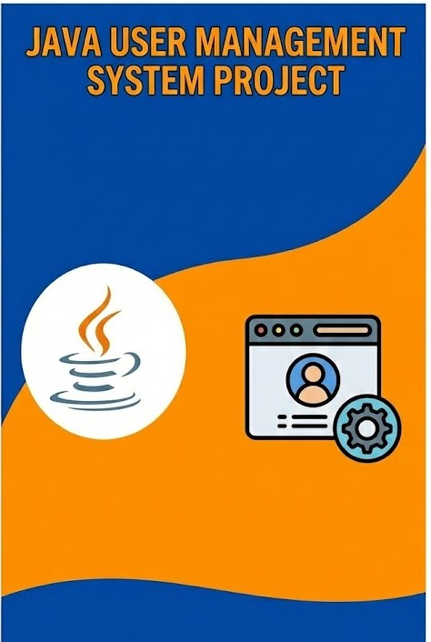

<h1 align="center">User Management System 👤</h1>



<h2 align="center">A Powerful RESTful API for Seamless User Management! 🌟</h2>

User Management System is a robust, production-ready backend application built on the powerful combination of Spring Boot and MySQL. It provides a clean and efficient way to manage users through RESTful API endpoints, making it perfect for any application that requires user data handling. 🚀💼

With User Management System, developers can easily integrate user creation and retrieval functionalities into their applications. The project follows industry-standard practices with a clean layered architecture, input validation, and proper exception handling. Whether you're building a web app, mobile backend, or microservice, this system provides a solid foundation for user management! 💡🔧

## Key Features

✨ **RESTful API Design**: User Management System follows REST principles, providing intuitive and predictable endpoints for seamless integration with any frontend or service.

✨ **Input Validation**: Built-in Jakarta Bean Validation ensures that all user data meets required criteria. Invalid emails or empty usernames are caught before they hit the database!

✨ **Clean Architecture**: Following the Controller-Service-Repository pattern, the codebase is organized, maintainable, and scalable. Each layer has a clear responsibility.

✨ **Custom Exception Handling**: Meaningful error responses with custom exceptions like `UserNotFoundException` and `InvalidUserDataException` make debugging a breeze.

✨ **Auto Schema Generation**: Hibernate automatically creates and updates database tables, so you can focus on building features instead of writing SQL scripts.

## User Management 👥💼

User Management System offers a streamlined approach to handling user data. Create new users with validated input and retrieve user information instantly through clean API endpoints. The system ensures data integrity while providing lightning-fast responses.


With User Management System's robust architecture, you can confidently build applications that scale while maintaining clean, readable code!

## API Endpoints 📡

| Method | Endpoint | Description |
|--------|----------|-------------|
| `GET` | `/api/users/{id}` | Retrieve a user by their ID |
| `POST` | `/api/users` | Create a new user |

### Create User Request Example:
```json
{
  "username": "john_doe",
  "email": "john@example.com"
}
```

### Response Example:
```json
{
  "id": 1,
  "username": "john_doe",
  "email": "john@example.com"
}
```

## Architecture 🏗️

```
┌──────────────────────────────────────────────────────┐
│                   CLIENT REQUEST                      │
└────────────────────────┬─────────────────────────────┘
                         │
                         ▼
┌──────────────────────────────────────────────────────┐
│              🎮 CONTROLLER LAYER                      │
│              UserController.java                      │
└────────────────────────┬─────────────────────────────┘
                         │
                         ▼
┌──────────────────────────────────────────────────────┐
│              ⚙️ SERVICE LAYER                         │
│              UserService.java                         │
└────────────────────────┬─────────────────────────────┘
                         │
                         ▼
┌──────────────────────────────────────────────────────┐
│              📦 REPOSITORY LAYER                      │
│              UserRepository.java                      │
└────────────────────────┬─────────────────────────────┘
                         │
                         ▼
┌──────────────────────────────────────────────────────┐
│              🐬 MySQL DATABASE                        │
└──────────────────────────────────────────────────────┘
```

## Tools Used 🛠️

<table align="center">
  <tr>
    <td align="center" width="170">
      
      <br>Java 17
    </td>
    <td align="center" width="170">
      
      <br>Spring Boot
    </td>
    <td align="center" width="170">
      
      <br>MySQL
    </td>
    <td align="center" width="170">
      
      <br>Maven
    </td>
  </tr>
  <tr>
    <td align="center" width="170">
      
      <br>Hibernate
    </td>
    <td align="center" width="170">
      
      <br>Lombok
    </td>
    <td align="center" width="170">
      
      <br>Spring Data JPA
    </td>
    <td align="center" width="170">
      
      <br>Postman
    </td>
  </tr>
  <tr>
    <td align="center" width="170">
      
      <br>IntelliJ IDEA
    </td>
    <td align="center" width="170">
      
      <br>VS Code
    </td>
    <td align="center" width="170">
      
      <br>GitHub
    </td>
    <td align="center" width="170">
      
      <br>Git
    </td>
  </tr>
</table>

## Get Started 🚀

Ready to set up your own User Management System? Follow these simple steps to get started:

1. Clone the repository to your local machine using the command: `git clone https://github.com/Shubh2-0/UserManagementSystem.git`.

2. Ensure you have Java Development Kit (JDK 17+) and Apache Maven installed on your system.

3. Create a MySQL database:
   ```sql
   CREATE DATABASE Cl_User_Management_System;
   ```

4. Update the database credentials in `src/main/resources/application.properties` if needed:
   ```properties
   spring.datasource.username=your_username
   spring.datasource.password=your_password
   ```

5. Navigate to the project directory: `cd UserManagementSystem/User_management_System`.

6. Build the project using Maven: `mvn clean install`.

7. Launch the application: `mvn spring-boot:run`.

8. Access the API at `http://localhost:8080/api/users`.

9. Test the endpoints using Postman or any REST client! 🎉

## Project Structure 📁

```
User_management_System/
├── 📄 pom.xml
├── 📄 mvnw / mvnw.cmd
└── 📂 src/
    └── 📂 main/
        ├── 📂 java/com/CL/
        │   ├── 📄 CognitionLabsUserManagementSystemApplication.java
        │   ├── 📂 entity/
        │   │   └── 📄 User.java
        │   ├── 📂 service/
        │   │   └── 📄 UserService.java
        │   ├── 📂 repository/
        │   │   └── 📄 UserRepository.java
        │   ├── 📂 controller/
        │   │   └── 📄 UserController.java
        │   └── 📂 exception/
        │       ├── 📄 UserNotFoundException.java
        │       └── 📄 InvalidUserDataException.java
        └── 📂 resources/
            └── 📄 application.properties
```

## Contribute 🤝

We believe in the power of collaboration! You're invited to contribute to the growth and improvement of User Management System. Here's how you can get involved 🤗:

1. Fork the repository and clone it: `git clone https://github.com/your-username/UserManagementSystem.git`.

2. Create a new branch: `git checkout -b feature/amazing-feature`.

3. Make your awesome changes and commit them: `git commit -m "Add amazing feature"`.

4. Push your branch to the repository: `git push origin feature/amazing-feature`.

5. Open a pull request on the GitHub repository and let us review your changes.

## Acknowledgements 🙏

User Management System was developed as a project for learning Spring Boot, REST APIs, and database integration. We extend our gratitude to the developers and contributors of Spring Boot, Hibernate, and all the libraries used in this project for their remarkable work.

<h2>📬 Contact</h2>

If you want to contact me, you can reach me through below handles.

<p align="left">
  <a href="https://www.linkedin.com/in/shubham-bhati-787319213/" target="_blank"></a>&emsp;
  <a title="shubhambhati226@gmail.com" href="mailto:shubhambhati226@gmail.com" target="_blank"></a>&emsp;
  <a href="https://wa.me/+916232133187" target="blank"></a>&emsp;
</p>

<hr>

<p align="center">
  Made with ❤️ using Spring Boot
  <br><br>
  ⭐ Star this repo if you find it helpful!
</p>
